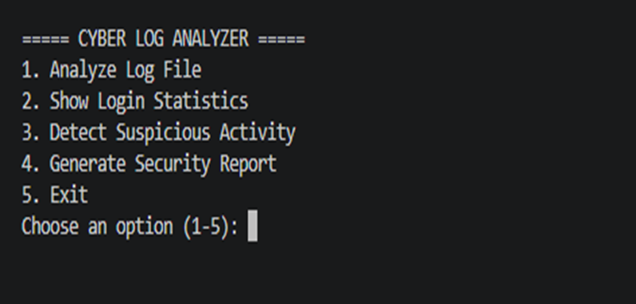
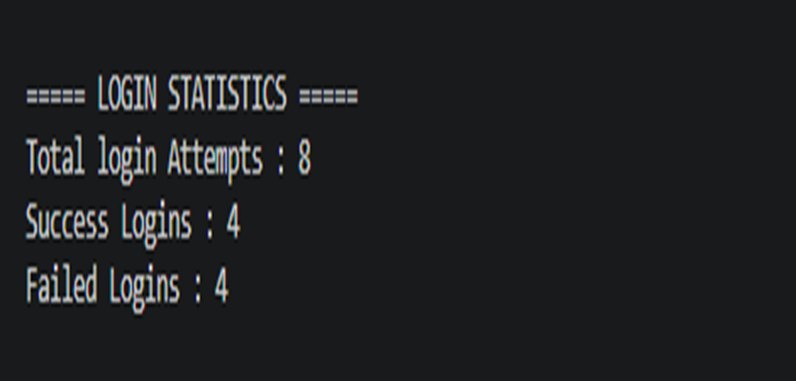
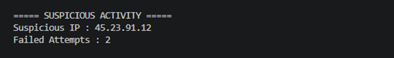

# 🔐 Cyber Log Analyzer

A command-line Python application for analyzing login log files, tracking successful and failed login attempts, detecting suspicious IP addresses, and generating security reports.

## Features

* Read and analyze login log files
* Count successful login attempts
* Count failed login attempts
* Track failed attempts by IP address
* Display login statistics
* Detect suspicious IP addresses
* Flag IP addresses with repeated failed login attempts
* Generate a cybersecurity report
* Save analysis results to a text file
* Handle invalid file names
* Menu-driven interface

## Technologies

* Python 3
* File Handling
* Functions
* Dictionaries
* Loops
* Conditional Statements
* Exception Handling
* User Input
* String Manipulation

## Run

```bash
python main.py
```

## Log Format

The analyzer reads login records in the following format:

```text
10:15 | 192.168.1.10 | admin | SUCCESS
10:20 | 45.23.91.12 | admin | FAILED
10:21 | 45.23.91.12 | admin | FAILED
```

## Screenshots

### Main Menu



### Log Analysis


### Login Statistics



### Suspicious Activity Detection



### Security Report


