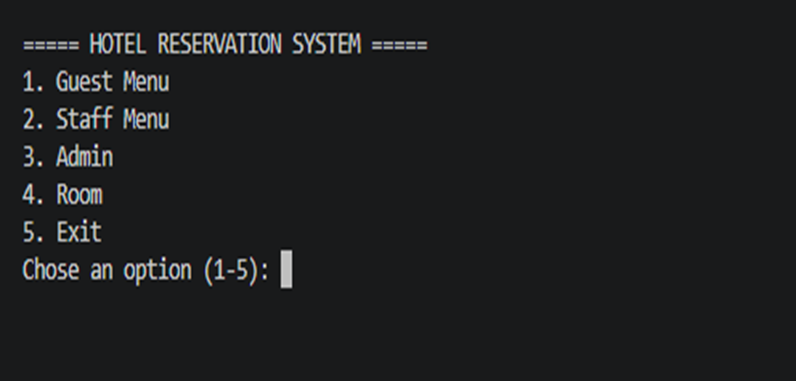
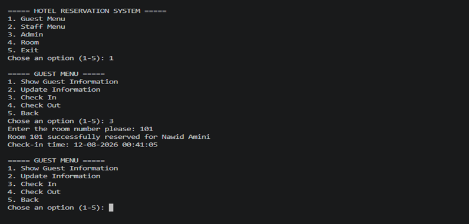
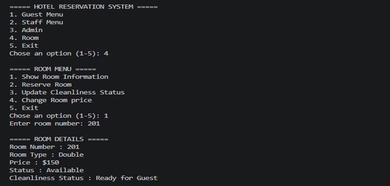
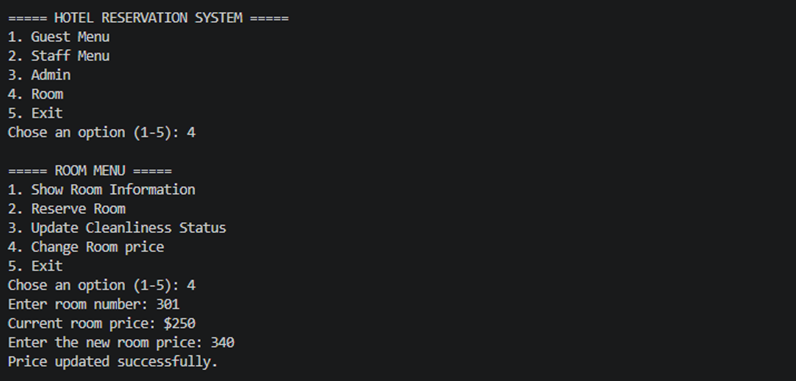

# 🏨 Hotel Reservation System

A command-line Python application for managing hotel guests, staff, rooms, reservations, and room status using object-oriented programming.

## Features

- Display guest information
- Update guest contact information
- Check in guests
- Check out guests
- Record automatic check-in and check-out time
- Display staff information
- Update staff information
- Start and end staff shifts
- Record automatic staff shift time
- Display admin information
- Display room information
- Reserve rooms
- Track room availability
- Update room cleanliness status
- Change room prices
- Manage multiple rooms
- Menu-driven interface

## Technologies

- Python 3
- Object-Oriented Programming (OOP)
- Classes & Objects
- Inheritance
- `super()`
- Attributes & Methods
- Dictionaries
- Loops
- Conditional Statements
- User Input
- `datetime`

## Run

```bash
python main.py
```

## Screenshots

### Main Menu



### Guest Check-In



### Room Information




### Room Price Update

