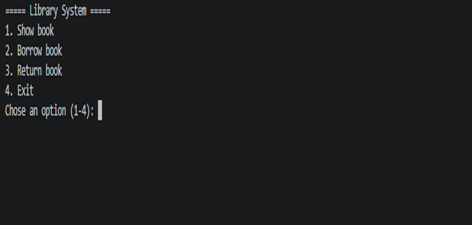
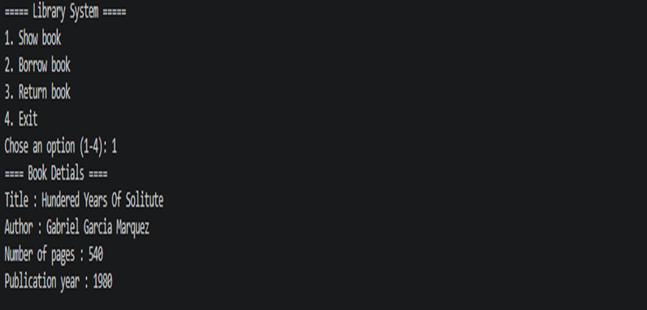

# 📚 Library Management System

A command-line Python application for borrowing and returning books using object-oriented programming.

## Features

- Display book information
- Borrow a book
- Return a book
- Track book availability
- Prevent borrowing unavailable books
- Prevent returning books that are already available
- Menu-driven interface

## Technologies

- Python 3
- Object-Oriented Programming (OOP)
- Classes & Objects
- Attributes & Methods
- Loops
- Conditional Statements
- User Input

## Run

```bash
python main.py
```

## Screenshots

### Main Menu



### Book Information



