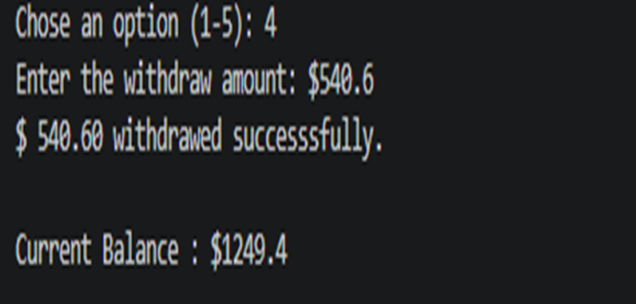

# 🏦 Personal ATM System

A command-line Python application for managing a bank account using object-oriented programming.

## Features

- View account information
- Check account balance
- Deposit money
- Withdraw money
- Validate deposit amounts
- Validate withdrawal amounts
- Prevent overdrawing the account
- Display updated balance after transactions
- Menu-driven interface

## Technologies

- Python 3
- Object-Oriented Programming (OOP)
- Classes & Objects
- Attributes & Methods
- Loops
- Conditional Statements
- Exception Handling
- User Input

## Run

```bash
python main.py
```

## Screenshots

### Main Menu


### Account Information


### Deposit Money


### Withdraw Money

