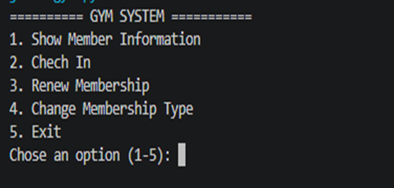
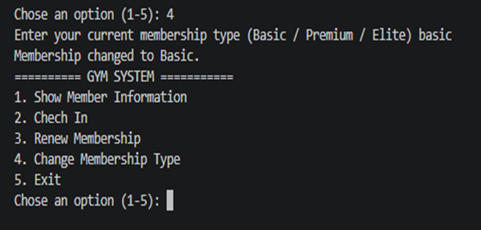
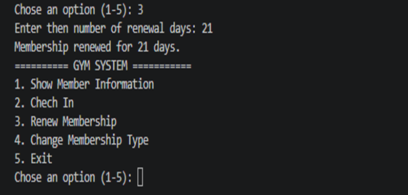

# 🏋️ Personal Gym Membership System

A command-line Python application for managing gym members, memberships, and daily check-ins.

## Features

- Display member information
- Check in to the gym
- Track total check-ins
- Renew membership
- Change membership type
- Track remaining membership days
- Validate membership types
- Prevent check-ins after membership expiration
- Menu-driven interface

## Technologies

- Python 3
- Object-Oriented Programming (OOP)
- Classes & Objects
- Attributes & Methods
- Loops
- Conditional Statements
- Exception Handling
- User Input

## Run

```bash
python main.py
```

## Screenshots

### Main Menu



### Member Information




### Membership Renewal


