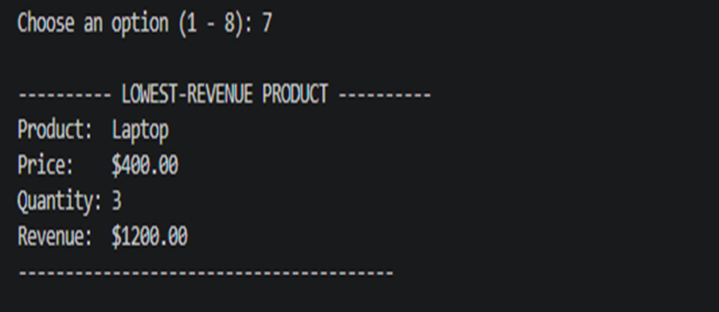

# 🛒 Small Shop Sales Analyzer

A command-line Python application for recording sales and analyzing shop revenue.

## Features

- Add a sale
- Display all sales
- Search for a product
- Remove a sale
- Show revenue summary
- Show highest-revenue product
- Show lowest-revenue product

## Technologies

- Python 3
- Lists
- Loops
- Functions
- Conditional statements

## Run

```bash
python main.py
```

## Screenshots

### Main Menu


### Add Sale


### Revenue Summary


### Lowest Revenue Product


