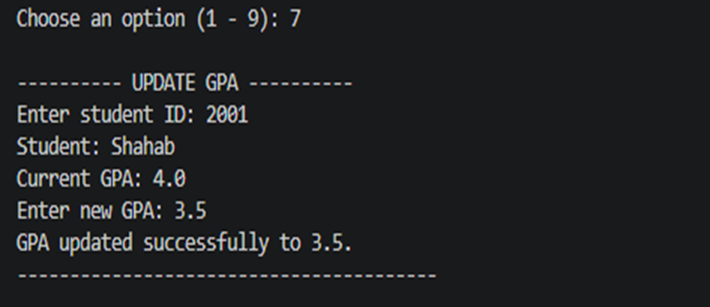

# 🎓 Student Management System

A command-line Python application for managing student records and academic information.

## Features

- Add a student
- Display all students
- Search for a student
- Remove a student
- Show highest GPA
- Show lowest GPA
- Update student GPA
- Show total number of students

## Technologies

- Python 3
- Lists
- Loops
- Functions
- Conditional statements

## Run

```bash
python main.py
```

## Screenshots

### Main Menu


### Add Student


### Highest GPA


### Total Students


### Update GPA


