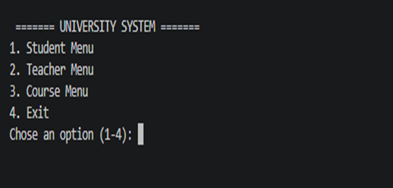
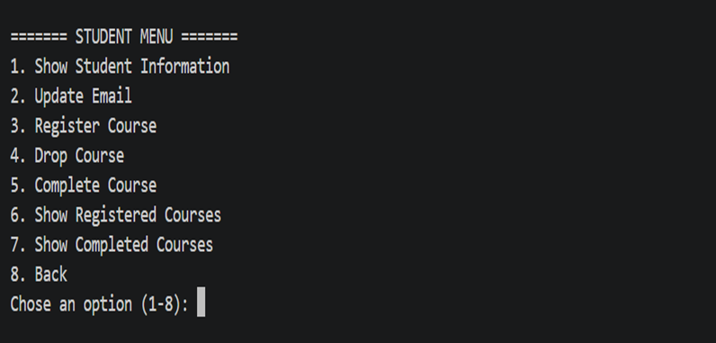
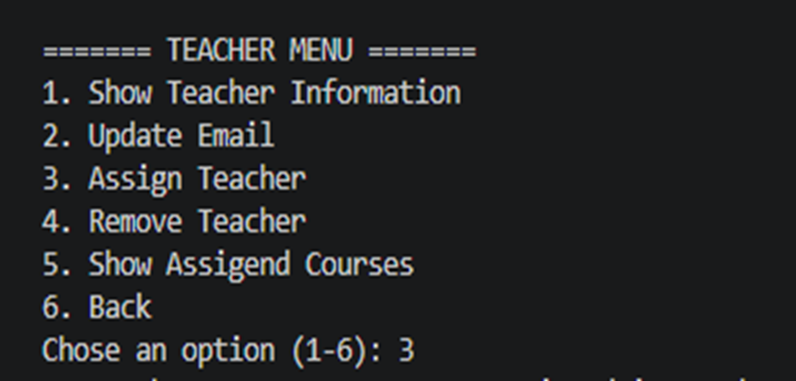
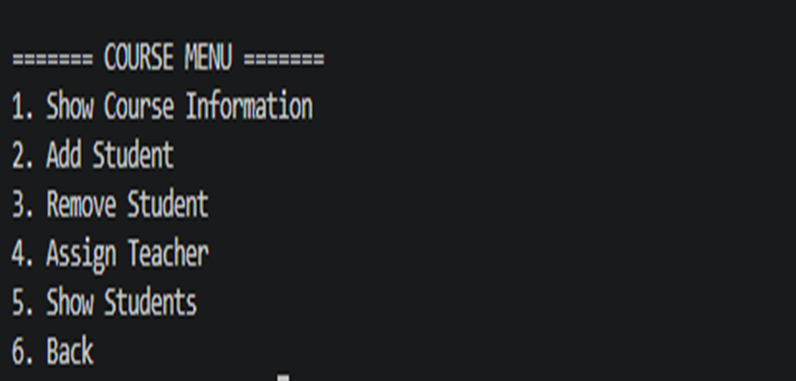
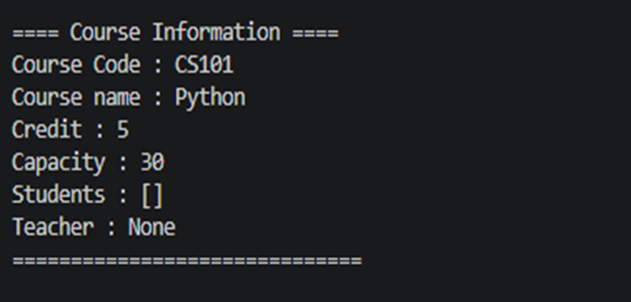

# 🎓 University Management System

A command-line Python application for managing students, teachers, and courses using object-oriented programming.

## Features

- View student information
- Update email address
- Register courses
- Drop courses
- Complete courses
- View registered courses
- View completed courses
- View teacher information
- Assign courses to teachers
- Remove courses from teachers
- View assigned courses
- View course information
- Add students to a course
- Remove students from a course
- Assign a teacher to a course
- View students
- Menu-driven interface

## Technologies

- Python 3
- Object-Oriented Programming (OOP)
- Classes & Objects
- Inheritance
- Attributes & Methods
- Lists
- Loops
- Conditional Statements
- User Input

## Run

```bash
python main.py
```

## Screenshots

### Main Menu



### Student Menu



### Teacher Menu



### Course Menu



### Course Information




